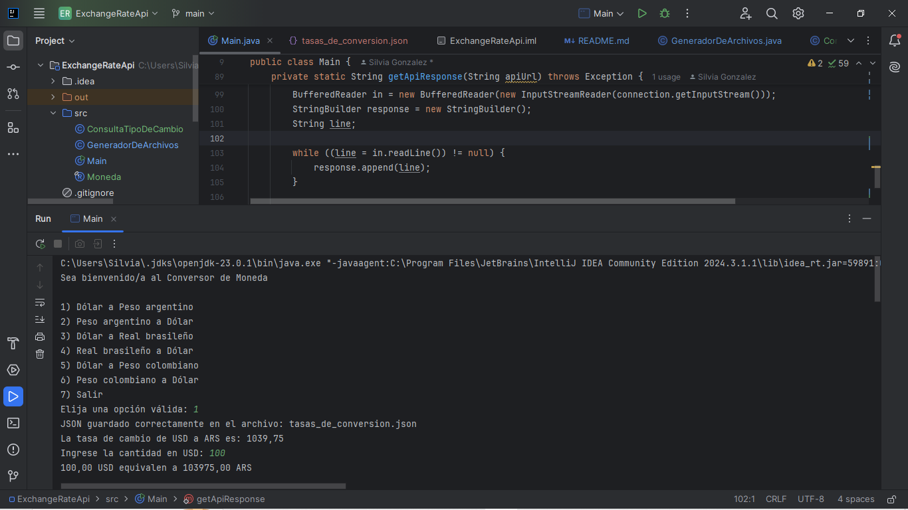
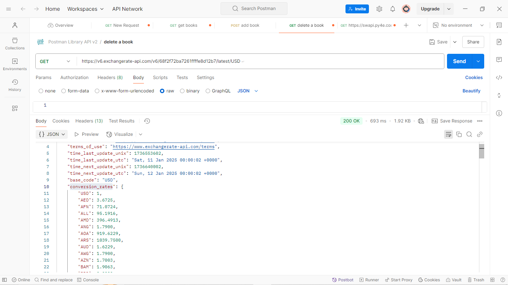

## ExchangeRateApi

### 🌍💸 **Conversor de Moneda - Proyecto Java** 💸🌍

Bienvenido/a al **Conversor de Moneda**, una poderosa herramienta desarrollada en Java que te permitirá realizar conversiones rápidas, precisas y fiables entre las monedas más importantes del mundo. Este proyecto utiliza una API de tasas de cambio en tiempo real para garantizar que siempre trabajes con los datos más actualizados. 🚀

---

## 📜 **Descripción del Proyecto**
El **Conversor de Moneda** es un programa diseñado para ayudarte a manejar las conversiones de divisas de manera eficiente. Desde dólares estadounidenses hasta pesos argentinos, reales brasileños o pesos colombianos, ¡navega fácilmente por las tasas de cambio y realiza cálculos en segundos!

Usamos tecnologías modernas como:
- 🛠 **Java**: Lenguaje de programación robusto y multiplataforma.
- 🌐 **API de Exchangerate-API**: Una solución en tiempo real para obtener tasas de cambio actuales.
- 📦 **Gson**: Librería de Java para manejar datos JSON con facilidad.

---

## ⚙️ **Características**
✔️ Interfaz intuitiva basada en consola.  
✔️ Soporte para múltiples divisas.  
✔️ Cálculos de conversión rápidos y precisos.  
✔️ Integración con API para obtener tasas de cambio actualizadas.  
✔️ Código modular y bien estructurado, fácil de mantener y escalar.

---

## 🛠 **Requisitos del Sistema**
- Java JDK 11 o superior.
- IntelliJ IDEA u otro IDE compatible con Java.
- Acceso a Internet para conectarse a la API.

---

## 🚀 **Cómo Usar**
1. Clona este repositorio:
   ```bash
   git clone https://github.com/SILVIAGONZALEZ1/ExchangeRateApi.git
   ```
2. Abre el proyecto en tu IDE favorito (recomendamos IntelliJ IDEA).
3. Configura tu clave de API en el archivo `ConsultaTipoDeCambio.java`.
4. Ejecuta el programa y selecciona las opciones que desees en el menú interactivo.

---

## 💻 **Estructura del Proyecto**
- `Main.java`: Clase principal que controla la interacción con el usuario.
- `Moneda.java`: Modelo que representa los datos de las tasas de cambio.
- `ConsultaTipoDeCambio.java`: Clase para gestionar las solicitudes a la API.

---

## 🎯 **Objetivos Futuros**
🔄 Soporte para más monedas y tasas de cambio históricas.  
📱 Versión gráfica o móvil.  
📊 Integración con gráficos para visualizar tendencias de cambio.

---

## 📣 **Agradecimientos**
Agradecemos a **Exchangerate-API** por proporcionar datos confiables de tasas de cambio, y a la increíble comunidad de desarrolladores que nos inspira todos los días. ¡Tu apoyo nos motiva a seguir creciendo y mejorando! 

🌟Quiero agradecer profundamente a Alura Latam y al programa One Oracle Next Education por el curso tan completo y enriquecedor que he recibido. Gracias a su excelente material y formación, puedo mejorar mis habilidades en desarrollo de software y avanzar en proyectos como este. 👩‍💻🚀

¡Muchas gracias por ofrecer una educación de calidad que hace la diferencia! 💡🎓

---

## 🤝 **Contribuciones**
¿Te gustaría contribuir? Nos encantaría recibir tus ideas. Siéntete libre de abrir un _issue_ o enviar un _pull request_.

---

## 📝 **Contacto**
📧 Email: [devsoftwaregonzalez@gmail.com](mailto:devsoftwaregonzalez@gmail.com)  
🐙 GitHub: [github.com/SILVIAGONZALEZ1](https://github.com/SILVIAGONZALEZ1)

---

**💖 Gracias por explorar mi proyecto! ¡Espero que lo encuentres útil y emocionante! 🌟**

